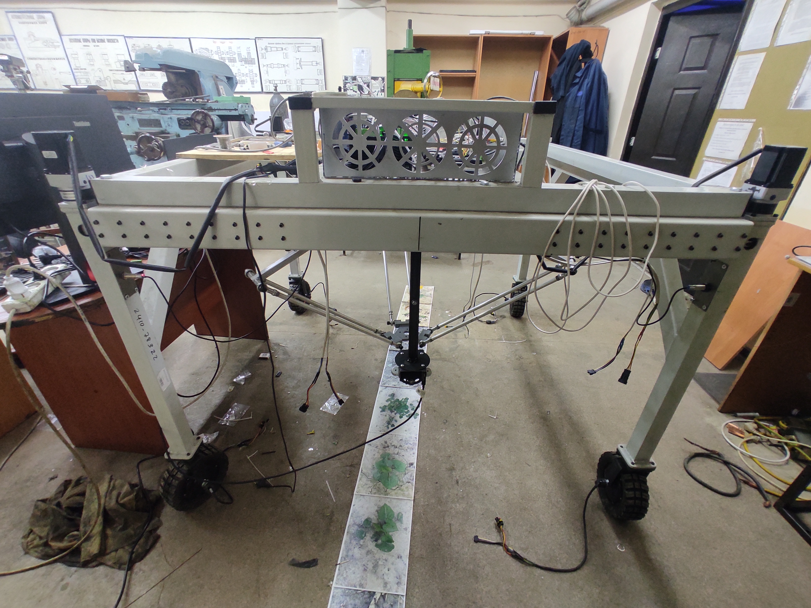
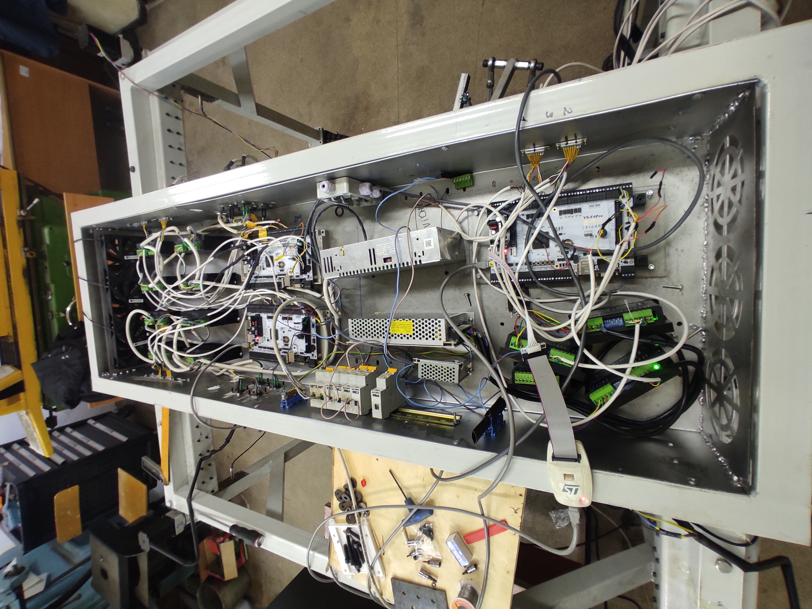

# AgroRobot Backend

Backend-сервис AgroRobot для компьютерного зрения, управления робототехническими модулями и предоставления HTTP/WebSocket API для frontend-интерфейса. Сервис разрабатывался для запуска на вычислительном устройстве робота: **NVIDIA Jetson AGX Orin Developer Kit 64GB**.





## Назначение

Backend является центральным программным слоем между веб-интерфейсом, камерой, нейросетевой моделью и STM32-контроллерами робота. Он запускается на Jetson, принимает команды от frontend, обрабатывает видеопоток, выполняет детекцию сорняков и отправляет Modbus RTU команды в нижнеуровневые прошивки.

Основные задачи:

- HTTP API для интерфейса оператора;
- WebSocket-события о состоянии робота и выполнении команд;
- работа с Intel RealSense или fallback на обычную webcam;
- MJPEG-трансляция сырого и обработанного видеопотока;
- запуск YOLO-модели `yolov11large.pt` для детекции;
- настройка зоны обработки изображения;
- преобразование координат камеры в координаты delta-робота;
- управление delta-роботом, механизмом ширины и поворотным механизмом;
- выбор serial-порта для RS-485;
- отправка Modbus RTU команд на STM32 slave-устройства.

## Аппаратная платформа

Целевое устройство:

- NVIDIA Jetson AGX Orin Developer Kit 64GB;
- Ubuntu/Linux окружение с CUDA;
- Python backend на FastAPI;
- камера Intel RealSense, при недоступности есть fallback на webcam index `0`;
- USB/RS-485 адаптер для связи со STM32-контроллерами;
- блок драйверов и контроллеров робота расположен в отдельном аппаратном отсеке, показанном на фото выше.

Jetson выполняет роль "мозга" робота: на нем работают backend, модель компьютерного зрения, сетевой API и сервисы, через которые оператор подключается к интерфейсу робота из локальной сети.

## Связанные репозитории

- Frontend интерфейса: публичная точка входа проекта.
- Backend: https://github.com/ErlanAyapov/agro-robot-backend
- Прошивка delta-робота: https://github.com/ErlanAyapov/delta-robot-firmware
- Прошивка механизма ширины: https://github.com/ErlanAyapov/robot-width-firmware
- Прошивка поворотного механизма: https://github.com/ErlanAyapov/turn-firmware

Нижнеуровневые прошивки могут быть private и предоставляться по запросу. Backend описывает их как устройства на одной Modbus RTU шине.

## Архитектура

```text
Frontend в браузере
        |
        | HTTP / WebSocket
        v
FastAPI backend на Jetson AGX Orin
        |
        | Camera API / OpenCV / YOLO
        v
RealSense / webcam + yolov11large.pt

FastAPI backend
        |
        | USB/RS-485, Modbus RTU
        v
STM32 slave 1: DeltaWeedingController
STM32 slave 2: WheelSteeringController
STM32 slave 3: WheelBaseWidthController
```

Шина устройств описана в `utils_limitswitch_rotate.py`:

| Slave | Устройство | Назначение |
| --- | --- | --- |
| 1 | `DeltaWeedingController` | delta-робот для позиционирования рабочего органа |
| 2 | `WheelSteeringController` | поворотный механизм колес |
| 3 | `WheelBaseWidthController` | механизм сужения/расширения шасси |

## Структура проекта

- `main.py` - FastAPI-приложение, видеопотоки, RealSense/webcam fallback, настройки, legacy endpoints.
- `robot_api/router.py` - современный `/api/v1` роутер.
- `robot_api/services.py` - сервисный слой для delta, width, turn, vision и transport.
- `robot_api/runtime.py` - зависимости runtime-слоя, передаваемые в сервисы.
- `robot_api/legacy_ui_router.py` - legacy-маршруты для старого интерфейса.
- `utils_limitswitch_rotate.py` - Modbus RTU команды для механизмов ширины, поворота и delta.
- `connection.py` - клиент delta-робота и команды загрузки траекторий.
- `core.py` - кинематика и логика delta-робота.
- `visualize_stream.py` - YOLO-визуализация, кеширование тестового видео и MJPEG-генераторы.
- `bres.py` - вспомогательная логика построения/обработки траекторий.
- `models.py` - Pydantic-модели.
- `robot_settings.json` - настройки координат, инверсии осей и confidence.
- `zone_config.json` - зона обработки изображения.
- `yolov11large.pt` - веса YOLO-модели.
- `video.mp4` - тестовое видео для визуализации.
- `cache/` - кешированные видео/метаданные визуализации.

## API

Основной API доступен по префиксу:

```text
/api/v1
```

Системные endpoints:

- `GET /api/v1/system/ports` - список serial-портов.
- `POST /api/v1/system/port` - выбор активного serial-порта.
- `GET /api/v1/system/devices` - состояние устройств на Modbus-шине.
- `GET /api/v1/robot/state` - агрегированное состояние робота.
- `GET/POST /api/v1/system/settings/robot` - настройки преобразования координат и детекции.
- `WS /api/v1/ws` - поток событий команд, fault-событий и состояния.

Delta-робот:

- `GET /api/v1/delta/state`
- `POST /api/v1/delta/home`
- `POST /api/v1/delta/move`
- `POST /api/v1/delta/process-target`
- `POST /api/v1/delta/stop`

Механизм ширины:

- `GET /api/v1/platform-width/state`
- `POST /api/v1/platform-width/home`
- `POST /api/v1/platform-width/target`
- `POST /api/v1/platform-width/stop`

Поворотный механизм:

- `GET /api/v1/platform-turn/state`
- `POST /api/v1/platform-turn/calibrate`
- `POST /api/v1/platform-turn/align-zero`
- `POST /api/v1/platform-turn/target`
- `POST /api/v1/platform-turn/target-angle`
- `POST /api/v1/platform-turn/stop`

Компьютерное зрение:

- `POST /api/v1/vision/start`
- `POST /api/v1/vision/stop`
- `GET /api/v1/vision/state`
- `GET /api/v1/vision/detections`
- `GET /api/v1/vision/video`
- `GET /api/v1/vision/processed-video`
- `GET /api/v1/vision/visualize-video`
- `GET/POST /api/v1/vision/zone`
- `POST /api/v1/vision/zone/move`

Также сохранены legacy endpoints: `/connection/*`, `/read/{slave_id}`, `/calibrate/{slave_id}`, `/go-work/{slave_id}`, `/robot/manual/*`, `/limitswitch/*`.

## Видео и детекция

Backend поддерживает несколько режимов видеопотока:

- сырой поток камеры: `GET /api/v1/vision/video`;
- обработанный поток с детекцией: `GET /api/v1/vision/processed-video`;
- визуализация по тестовому видео: `GET /api/v1/vision/visualize-video`.

При запуске сервис пытается открыть RealSense в color-режиме. Если RealSense недоступна, используется fallback на webcam. Для детекции используется Ultralytics YOLO с весами:

```text
yolov11large.pt
```

На Jetson AGX Orin при наличии CUDA backend выбирает `cuda:0`. В frontend обработанный поток запрашивается с параметрами `device=cuda:0`, `half=true`, `detection_imgsz=640`.

## Настройки

`robot_settings.json`:

```json
{
  "xy_rotation_deg": 95.0,
  "invert_x": false,
  "invert_y": false,
  "invert_z": false,
  "detection_conf": 0.5
}
```

Эти параметры используются для ручной отправки координат и для преобразования координат из системы камеры в систему delta-робота.

`zone_config.json`:

```json
{
  "offset_x_px": -12,
  "offset_y_px": -24,
  "size_px": 295,
  "size_mm": 350.0
}
```

Эта зона задает область изображения, которая используется при детекции и переводе пикселей в миллиметры.

## Запуск

Создание окружения:

```bash
python -m venv .venv
source .venv/bin/activate
pip install -r requirements.txt
```

Запуск backend:

```bash
uvicorn main:app --host 0.0.0.0 --port 8000
```

После запуска API доступно по:

```text
http://<robot-ip>:8000/api/v1
```

Swagger UI:

```text
http://<robot-ip>:8000/docs
```

## Развертывание вместе с frontend

На конечном устройстве робот обычно запускается так:

1. Backend работает на Jetson AGX Orin на `0.0.0.0:8000`.
2. Nginx отдает статический frontend на `80` порту.
3. Оператор открывает `http://<robot-ip>/`.
4. Frontend сам обращается к `http://<robot-ip>:8000/api/v1`.
5. Backend через выбранный serial-порт управляет STM32-контроллерами на RS-485.

FastAPI включает CORS для всех origin, поэтому интерфейс может быть открыт с другого устройства в той же сети.

## Важные зависимости

Ключевые пакеты из `requirements.txt`:

- `fastapi`, `uvicorn` - HTTP/WebSocket API;
- `opencv-python` - обработка видео;
- `pyrealsense2` - работа с Intel RealSense;
- `ultralytics`, `torch`, `torchvision` - YOLO-инференс;
- `pymodbus`, `pyserial` - связь по RS-485/Modbus RTU;
- `numpy`, `scipy`, `pandas`, `scikit-image` - вычисления и обработка данных.

Для Jetson важно ставить версии PyTorch/torchvision, совместимые с JetPack/CUDA конкретного образа.

## Эксплуатационный порядок

1. Подключить STM32-контроллеры к RS-485 шине.
2. Подключить камеру RealSense к Jetson.
3. Запустить backend на `0.0.0.0:8000`.
4. Открыть frontend через Nginx.
5. Выбрать serial-порт в интерфейсе.
6. Проверить `/api/v1/system/devices`.
7. Выполнить калибровку:
   - delta, slave `1`;
   - поворотный механизм, slave `2`;
   - механизм ширины, slave `3`.
8. Запустить видеопоток или обработку с отправкой команд.

## Медиа

- `IMG_20260404_200405.jpg` - общий вид робота.
- `IMG_20260404_200413.jpg` - блок контроллеров и драйверов, где расположен вычислительный модуль и управляющая электроника.

